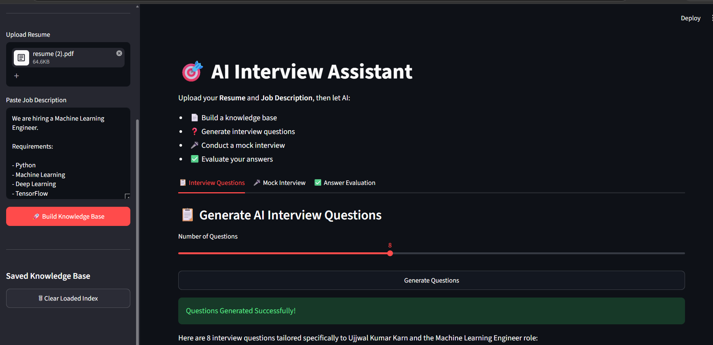

<div align="center">

# 🎯 AI Interview Assistant using Retrieval-Augmented Generation (RAG)

### Turn any Resume and Job Description into your personal AI Interview Coach


</div>

---

# 📖 Overview

AI Interview Assistant is a Retrieval-Augmented Generation (RAG) application that helps candidates prepare for interviews using their own resume and a target job description.

Instead of generating generic interview questions, the application first retrieves relevant information from the uploaded documents using semantic search and then uses an LLM to generate personalized interview questions, conduct mock interviews, and evaluate answers.

---

# 🖼️ Application Preview

<p align="center">

</p>

<p align="center">
<b>Figure:</b> AI Interview Assistant built with Streamlit. Upload a resume and job description, build a FAISS knowledge base, generate personalized interview questions, conduct an AI-powered mock interview, and receive detailed answer evaluation using Retrieval-Augmented Generation (RAG).
</p>

---

# ✨ Features

- 📄 Upload Resume (PDF, DOCX, TXT)
- 💼 Paste any Job Description
- 🧠 Build a semantic knowledge base using FAISS
- 🤖 Generate personalized interview questions
- 🎤 AI-powered mock interview
- ✅ Evaluate interview answers with detailed feedback
- 🔍 Semantic document retrieval using Sentence Transformers
- ⚡ Supports Gemini, Groq, Anthropic and OpenAI models
- 💾 Save and reload vector database locally

---

# 🧠 How It Works

```
                Resume + Job Description
                          │
                          ▼
                 Document Loader
                          │
                          ▼
                 Text Chunking
                          │
                          ▼
        Sentence Transformer Embeddings
                          │
                          ▼
                FAISS Vector Database
                          │
                          ▼
                Similarity Search (RAG)
                          │
                          ▼
          Gemini / Groq / OpenAI / Claude
                          │
          ┌───────────────┼────────────────┐
          ▼               ▼                ▼
 Interview Questions  Mock Interview  Answer Evaluation
```

---

# 📂 Project Structure

```
ai-interview-assistant-rag/
│
├── app.py
├── README.md
├── requirements.txt
├── .env.example
│
├── src/
│   ├── config.py
│   ├── prompts.py
│   ├── ingest.py
│   ├── vectorstore.py
│   ├── rag_pipeline.py
│   ├── question_generator.py
│   ├── answer_evaluator.py
│   └── mock_interview.py
│
├── scripts/
│   └── build_index.py
│
├── data/
│   ├── resumes/
│   └── job_descriptions/
│
├── vectorstore/
│
└── app-ui.png
```

---

# 🛠️ Tech Stack

| Category | Technology |
|----------|------------|
| Language | Python |
| UI | Streamlit |
| Framework | LangChain |
| LLM | Gemini 2.5 Flash |
| Vector Database | FAISS |
| Embeddings | Sentence Transformers |
| PDF Processing | PyPDF |
| DOCX Processing | python-docx |
| Environment | python-dotenv |

---

# ⚙️ Installation

## Clone Repository

```bash
git clone https://github.com/ujjwal540/ai-interview-assistant-rag.git

cd ai-interview-assistant-rag
```

---

## Create Virtual Environment

### Windows

```bash
py -3.11 -m venv .venv

.venv\Scripts\activate
```

### Linux / macOS

```bash
python3 -m venv .venv

source .venv/bin/activate
```

---

## Install Dependencies

```bash
pip install -r requirements.txt
```

---

## Configure Environment

Create a `.env` file.

Example:

```env
LLM_PROVIDER=gemini

GEMINI_API_KEY=YOUR_API_KEY

EMBEDDING_PROVIDER=local

EMBEDDING_MODEL=sentence-transformers/all-MiniLM-L6-v2

VECTORSTORE_DIR=vectorstore

CHUNK_SIZE=1000

CHUNK_OVERLAP=200

RETRIEVER_TOP_K=4
```

## Run Application

```bash
streamlit run app.py
```

Open:

```
http://localhost:8501
```

---

# 🚀 Usage

1. Upload your Resume.
2. Paste the target Job Description.
3. Click **Build Knowledge Base**.
4. Generate personalized interview questions.
5. Practice using Mock Interview.
6. Evaluate your answers with AI feedback.

---

# 📌 Example Job Description

```
We are hiring a Machine Learning Engineer.

Requirements:

• Python

• Machine Learning

• Deep Learning

• TensorFlow

• SQL

• Communication Skills
```

---

# 🚀 Future Improvements

- 🎙 Voice Interview Support
- 📊 Interview Performance Dashboard
- 📈 Resume Improvement Suggestions
- 🌐 Multi-language Support
- ☁️ Cloud Deployment
- 📚 Interview History

---

# 👨‍💻 Author

**Ujjwal Kumar Karn**

GitHub:
https://github.com/ujjwal540

---

⭐ If you found this project useful, consider giving it a Star on GitHub.
